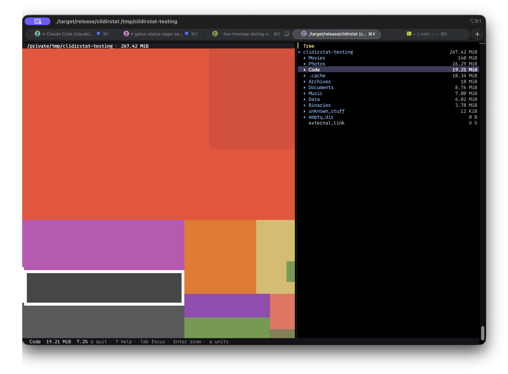

# clidirstat

A terminal disk-usage analyzer with a WinDirStat-style recursive treemap.
Every file becomes a coloured tile, sized by disk usage and coloured by
extension. Renders live during scan, ~3× faster than `du -sh` on macOS.



## Install

**Easy on macOS or Linux:**

```sh
curl --proto '=https' --tlsv1.2 -LsSf https://github.com/EricBriscoe/clidirstat/releases/latest/download/clidirstat-installer.sh | sh
```

Close and reopen Terminal, then run `clidirstat`. Press `?` for keys, `q` to quit.

**From source:**

```sh
git clone https://github.com/EricBriscoe/clidirstat
cd clidirstat
cargo install --path .
```

Requires Rust 1.85+ (rustup will fetch it via `rust-toolchain.toml`).

## Performance

Apple Silicon, warm cache:

| Corpus                                 | clidirstat | `du -sh` |
| -------------------------------------- | ---------- | -------- |
| `/usr/share` — 267 MiB, 20 K files     | **68 ms**  | 163 ms   |
| `~/.cargo` — 340 MiB, 20 K files       | **47 ms**  | n/a      |

The macOS fast path uses `getattrlistbulk(2)`, which returns ~200 entries
with full stat data per syscall, so per-file cost collapses to near zero.
Linux uses a parallel `readdir` walker.

Reproduce:

```sh
./scripts/make-demo-tree.sh /tmp/clidirstat-testing
hyperfine --warmup 1 './target/release/clidirstat /tmp/clidirstat-testing --timeit'
```

## License

[MIT](./LICENSE)
